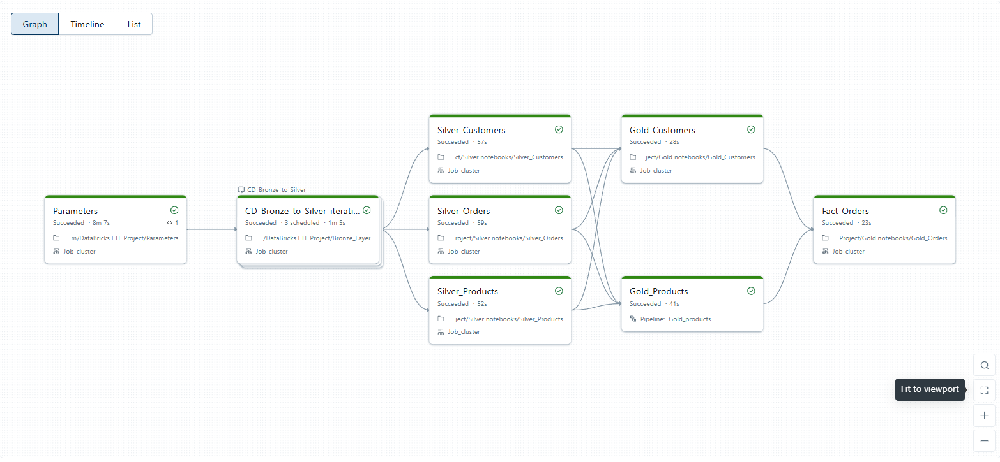

# 🚀 Databricks Lakehouse — Production-Ready (Bronze → Silver → Gold)

**One-liner:** A real, governed Lakehouse: **Auto Loader** brings data in, **Silver** cleans & conforms, **Gold** serves star-schema analytics with **MERGE** and **DLT SCD-2**. Built to **scale, audit, and extend**.

---

## 📦 What’s Inside (Notebooks)
- **Parameters** – fan-out driver for datasets & flags  
- **Bronze_Layer** – incremental ingest (Auto Loader, checkpoints, schema evo)  
- **Silver_Customers / Orders / Products / Regions** – cleanse, dedupe, enrich  
- **Gold_Customers** – Type-1 style upserts (Delta **MERGE**)  
- **Gold_Products (DLT)** – **SCD-2** dimension with expectations  
- **Gold_Orders** – conformed fact from Silver + Gold dims (MERGE)

---

## 🧭 Architecture (at a glance)
**Landing** → **🥉 Bronze** *(raw, append-only, checkpointed)* → **🥈 Silver** *(clean, standardized, deduped)* → **🥇 Gold** *(star schema: SCD-2 dims, upserted facts)*  
**Orchestration:** Databricks **Workflows** (DAG) + **Delta Live Tables** for quality & history.

---

## ⭐ Why It’s Production-Grade
- **Idempotent & Incremental**: Auto Loader + checkpoints; Delta **ACID** tables
- **Governed**: Unity Catalog naming, permissions, lineage
- **Data Quality**: DLT expectations; `_rescued_data` handled upstream
- **Change-aware**: **SCD-2** (Products), **MERGE** upserts (Customers, Facts)
- **Observable**: Workflow run states, DLT metrics, Delta history/audit
- **Performance-ready**: Partition/Z-Order, OPTIMIZE/VACUUM policies

---

## 🧱 Gold Model (BI-ready)
- **Dimensions**:  
  - `DimCustomers` – Type-1 (MERGE)  
  - `DimProducts` – **SCD-2** (validity windows, `is_current`)
- **Fact**:  
  - `FactOrders` – joins to dims, incremental **MERGE**

---

## 🔧 Operate in 5 Steps
1) Configure UC catalog/schemas & storage locations  
2) Deploy notebooks; set up **DLT** (Products) & **Workflow** DAG  
3) Set Parameters (datasets, initial-load flags)  
4) Run on schedule or trigger ad-hoc  
5) Monitor DLT/Workflow; maintain with OPTIMIZE/VACUUM

---

## 🧰 Stack
**Databricks (Unity Catalog, Workflows, DLT)** • **Delta Lake** • **Auto Loader** • **PySpark/SQL** • **ADLS (ABFSS)**

---

## 📝 Recruiter Snapshot
- Built with **operational mechanics** (incremental ingest, governed layers, DQ gates)  
- **Historical correctness** via SCD-2 + **auditable** Delta history  
- **Easy to extend**: add sources, clone Silver pattern, wire to Gold

---

